# Precision Lapping Machine

This project was created by:

+ Filip Lennhager, `filip@lennhager.se`
+ Filip Karlsson
+ Albin Magnusson
+ Ali Halbastian Abdulla
+ Anton Meuller
+ Christian Mallqui Castro
+ Toni Carillo

## Table of Contents

1. [Prototype](#prototype)
2. [Disc and Fixation](#disc-and-fixation)
3. [Gearbox](#gearbox)
4. [Control System](#control-system)
    + [PCB](#pcb)
        + [Electrical Schematic](#electrical-schematic)
        + [Physical Schematic](#electrical-schematic)
    + [Code](#code)

## Prototype

CAD model of the prototype:

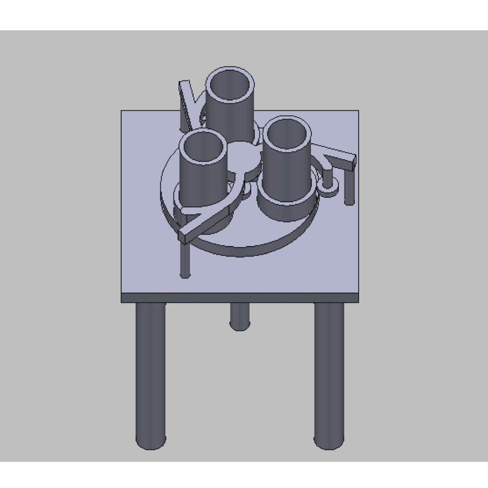

## Disc and Fixation

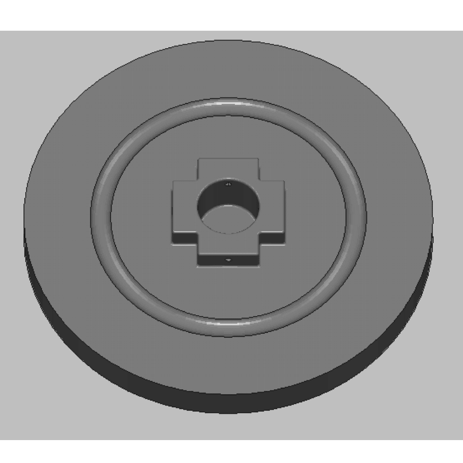
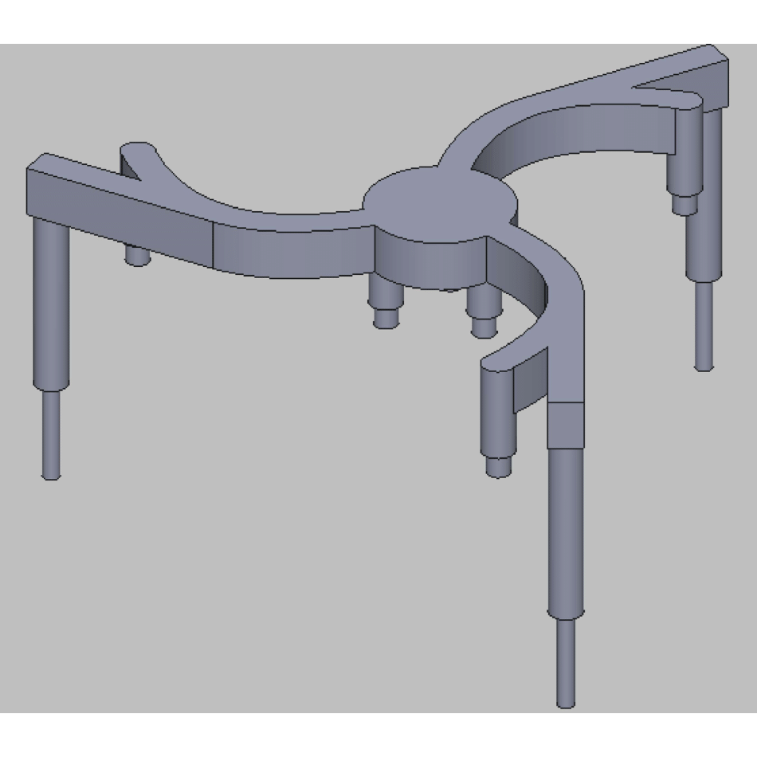
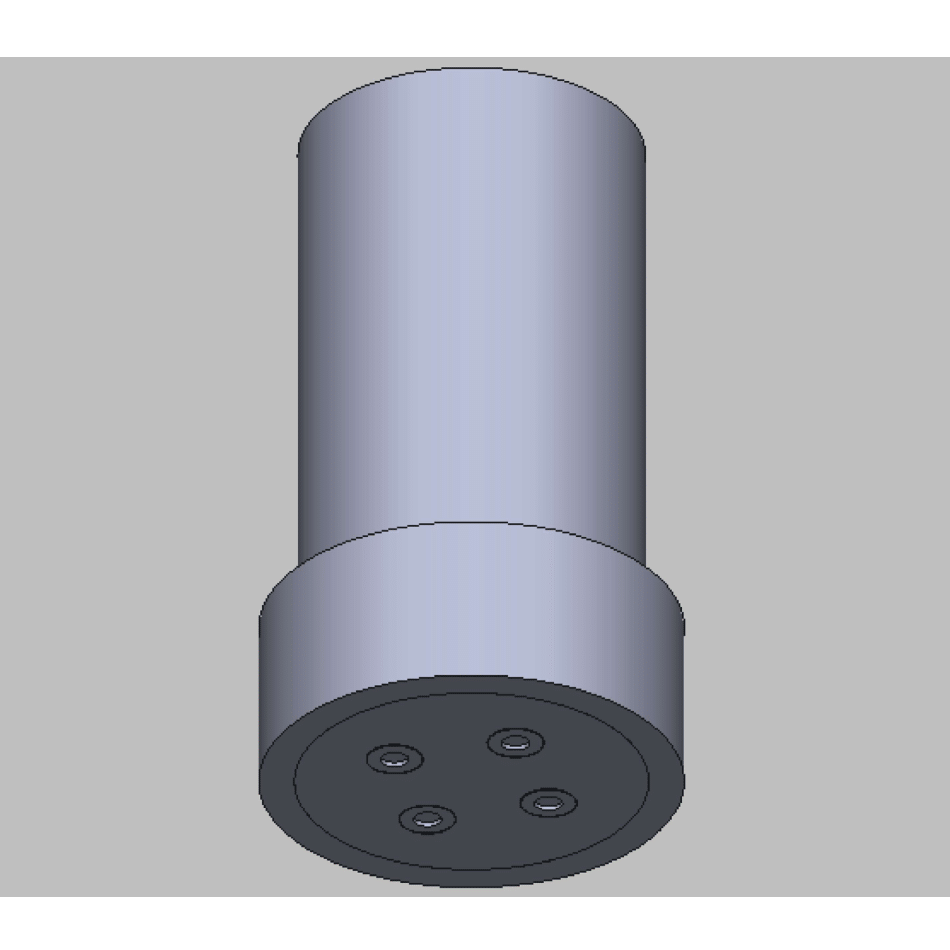

## Gearbox

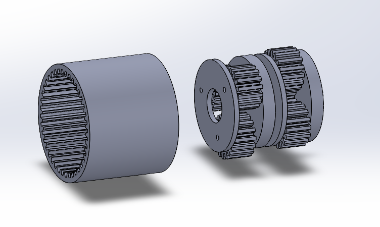

## Control System

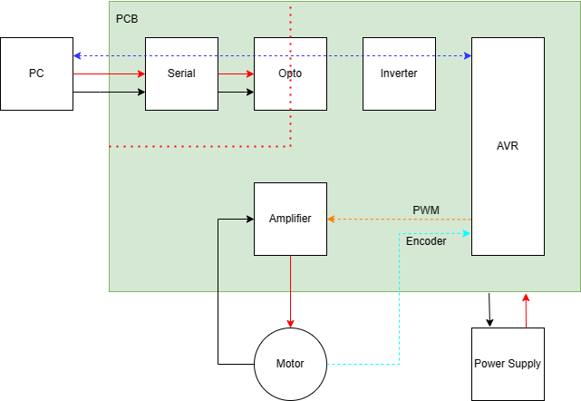

### PCB

#### Electrical Schematic

An overview of the electrical schematic can be found in the file: [`Precision-Lapping-Machine-1.png`](Control_System/PCB/Electrical_Schematic/Precision-Lapping-Machine-1.png):

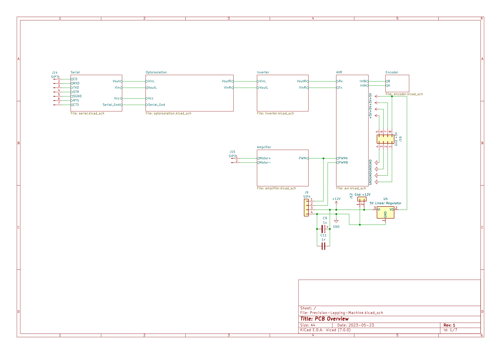
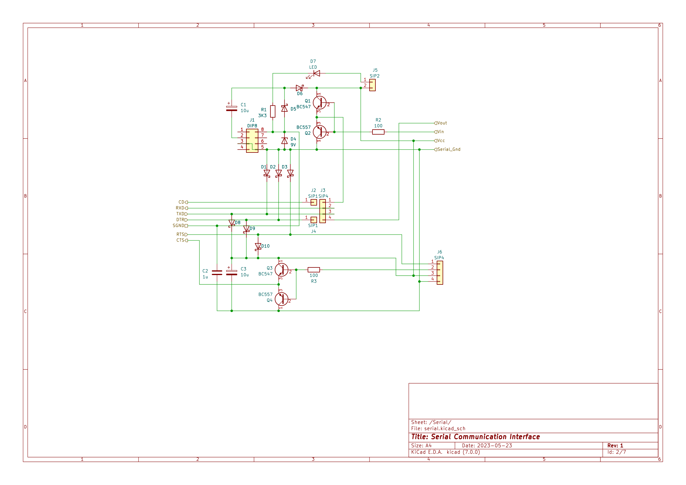
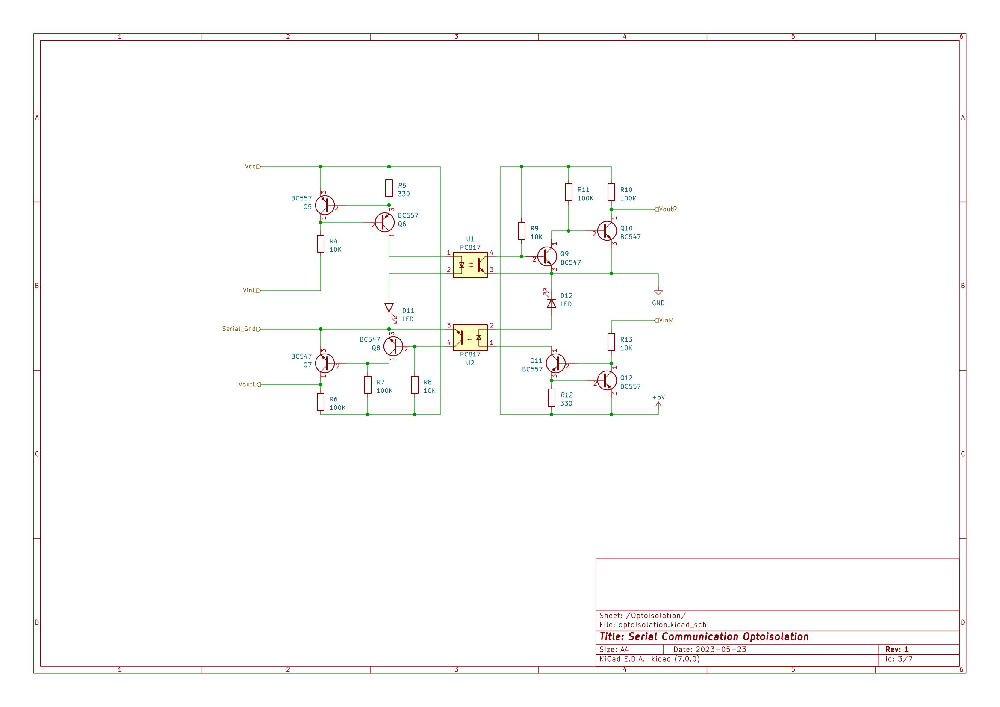
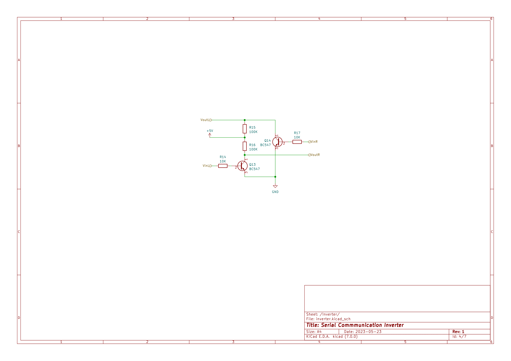
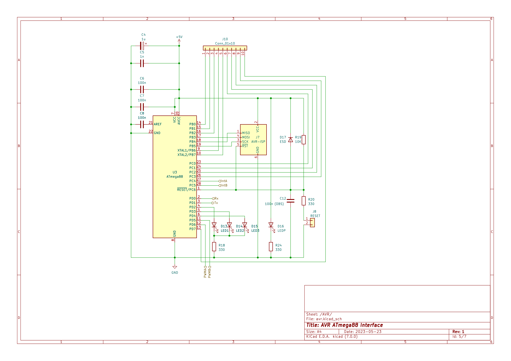
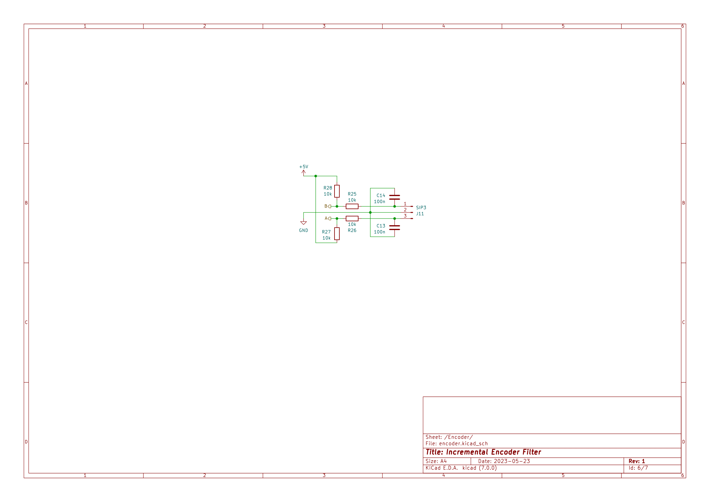
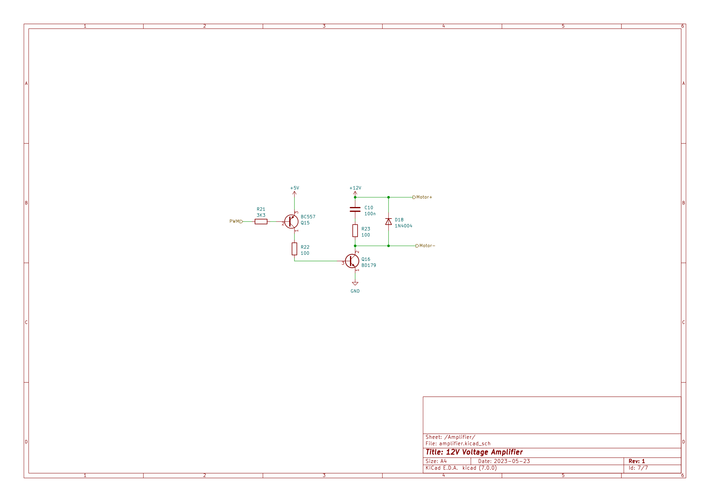

#### Physical Schematic

Schematic of PCB with physical component placement:

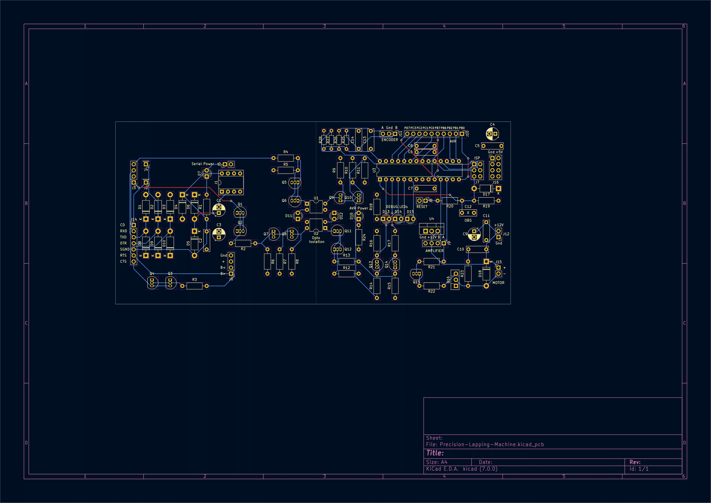

Gerber and drill files for pcb fabrication:

.png)
.png)
.png)
.png)
.png)
.png)
.png)
.png)
.png)

### Code
